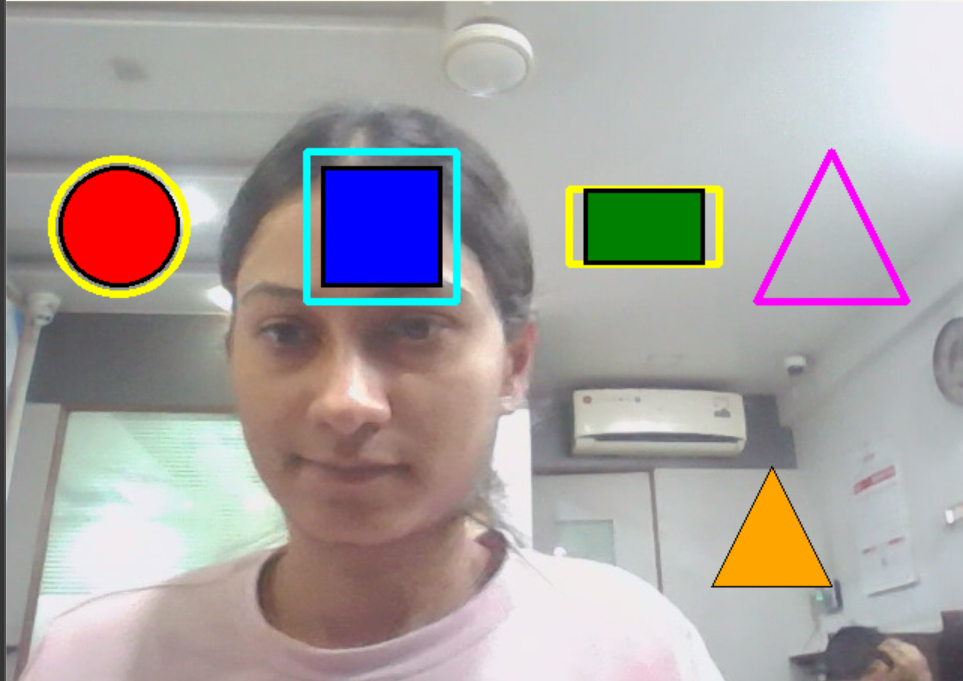
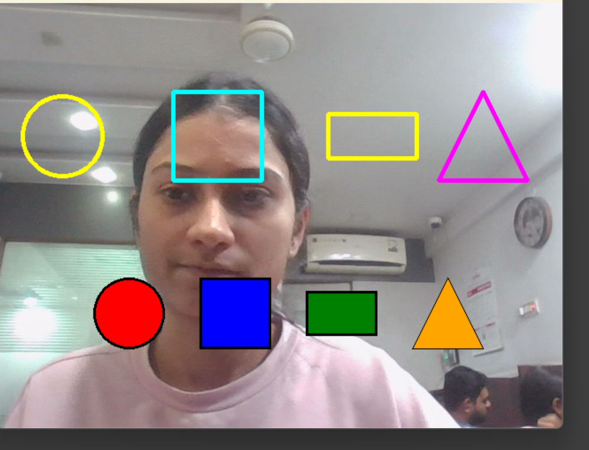

## 📸 Screenshot

Here is the main interface of the gestures shape

✨ Features

👋 Pinch gesture detection using your webcam

🧩 Drag and snap shapes to their matching outlines

🔊 Sound feedback on successful matches (optional)

🖼️ Dynamic shape generation using Python’s Pillow (circle, square, rectangle, triangle)

✅ Auto-detects working webcam

🖥️ Fullscreen OpenCV interface

📦 Technologies Used

OpenCV
 – for webcam and GUI

MediaPipe
 – hand tracking

Pillow (PIL)
 – generating shape images

Pygame
 – sound effects

Python 3.x
